# 🤖 Sistema de Agente Inteligente con LLM Personalizado

<div align="center">
  
  <br/>
  <em>Arquitectura del Sistema LLM-Agente</em>
</div>

## 📋 Índice
- [Descripción General](#descripción-general)
- [Arquitectura del Sistema](#arquitectura-del-sistema)
- [Componentes del Sistema](#componentes-del-sistema)
- [Implementación Técnica](#implementación-técnica)
- [Flujo de Datos](#flujo-de-datos)
- [Configuración](#configuración)
- [API Reference](#api-reference)
- [Guía de Uso](#guía-de-uso)
- [Proceso de Aprendizaje](#proceso-de-aprendizaje)
- [Características Avanzadas](#características-avanzadas)
- [Despliegue](#despliegue)
- [Contribución](#contribución)

## 🎯 Descripción General

Este proyecto implementa un sistema de agente inteligente que utiliza un modelo de lenguaje (LLM) personalizado para el procesamiento y aprendizaje de tareas. El sistema está diseñado para ser modular, extensible y fácilmente configurable, permitiendo la integración de diferentes modelos de lenguaje y comportamientos del agente.

### Características Principales
- 🤖 Agente inteligente con estados y comportamientos configurables
- 🧠 Integración con modelos de lenguaje personalizados
- 📚 Sistema de aprendizaje y entrenamiento
- 🔄 Proceso de decisión basado en LLM
- 📊 Monitoreo y métricas de rendimiento
- 🔒 Seguridad y autenticación integrada

## 🏗 Arquitectura del Sistema

### Diagrama de Arquitectura


### Capas del Sistema
1. **Capa de Presentación**
   - Controladores REST
   - Endpoints API
   - Manejo de solicitudes

2. **Capa de Servicio**
   - Lógica de negocio
   - Integración LLM-Agente
   - Procesamiento de datos

3. **Capa de Persistencia**
   - Repositorios
   - Entidades
   - Base de datos

## 🔧 Componentes del Sistema

### 1. Modelo LLM (`LLMModel`)
```java
/**
 * Entidad principal que representa un modelo de lenguaje (LLM).
 * Esta clase almacena toda la configuración y datos relacionados con un modelo específico.
 */
@Entity
@Table(name = "llm_models")
public class LLMModel {
    // Identificador único del modelo
    @Id
    @GeneratedValue(strategy = GenerationType.IDENTITY)
    private Long id;
    
    // Nombre del modelo (ej: "GPT-4", "Gemini-Pro")
    @Column(nullable = false)
    private String name;
    
    // Versión del modelo (ej: "1.0", "2.0")
    @Column(nullable = false)
    private String version;
    
    // Tipo de modelo (GPT, GEMINI, etc.)
    @Column(nullable = false)
    private String modelType;
    
    // Número máximo de tokens que puede procesar el modelo
    @Column(nullable = false)
    private Integer maxTokens;
    
    // Temperatura para la generación (0.0 - 1.0)
    // Valores más bajos = respuestas más deterministas
    // Valores más altos = respuestas más creativas
    @Column(nullable = false)
    private Double temperature;
    
    // Lista de datos de entrenamiento asociados al modelo
    // CascadeType.ALL asegura que los datos se eliminen si se elimina el modelo
    @OneToMany(mappedBy = "model", cascade = CascadeType.ALL)
    private List<TrainingData> trainingData = new ArrayList<>();
    
    // Lista de parámetros específicos del modelo
    @OneToMany(mappedBy = "model", cascade = CascadeType.ALL)
    private List<ModelParameter> parameters = new ArrayList<>();
}
```
**Explicación**: Esta entidad representa el modelo de lenguaje. Almacena la configuración básica del modelo, incluyendo su nombre, versión, tipo y parámetros de generación. Mantiene relaciones con los datos de entrenamiento y parámetros específicos.

#### Características
- **Configuración**: Parámetros del modelo ajustables
- **Versiones**: Control de versiones del modelo
- **Entrenamiento**: Gestión de datos de entrenamiento
- **Rendimiento**: Métricas y monitoreo

### 2. Agente Inteligente (`Agent`)
```java
@Component
public class Agent {
    private AgentState currentState;
    private AgentMemory memory;
    private Behavior behavior;
    private Sensor sensor;
    private DecisionMaker decisionMaker;
    // ... implementación
}
```

#### Estados del Agente
| Estado | Descripción |
|--------|-------------|
| IDLE | Estado de espera |
| PERCEIVING | Perceptando el entorno |
| THINKING | Procesando información |
| ACTING | Ejecutando acciones |
| LEARNING | Aprendiendo de nuevos datos |
| ERROR | Manejo de errores |

### 3. Sistema de Entrenamiento
```java
@Service
public class LLMAgentService {
    @Transactional
    public void trainAgentWithLLM(Long modelId) {
        // Implementación del entrenamiento
    }
}
```

## 💻 Implementación Técnica

### 1. Integración LLM-Agente
```java
@Service
public class LLMAgentService {
    private final LLMService llmService;
    private final Agent agent;

    @Transactional
    public void trainAgentWithLLM(Long modelId) {
        Optional<LLMModel> modelOpt = llmService.getModel(modelId);
        if (modelOpt.isPresent()) {
            LLMModel model = modelOpt.get();
            List<TrainingData> trainingData = model.getTrainingData();
            agent.updateState(AgentState.LEARNING);
            // Procesamiento de datos
        }
    }
}
```

### 2. Procesamiento de Datos
```java
private void processTrainingData(TrainingData data) {
    // 1. Procesar input
    String processedInput = preprocessInput(data.getInput());
    
    // 2. Aplicar aprendizaje
    LearningResult result = applyLearning(processedInput);
    
    // 3. Validar resultados
    validateResults(result, data.getExpectedOutput());
}
```

## 🔄 Flujo de Datos

### 1. Entrenamiento


### 2. Ejecución


## ⚙️ Configuración

### 1. Requisitos del Sistema
- Java 17+
- PostgreSQL 13+
- Maven 3.8+
- Spring Boot 3.0+
- Docker (opcional)

### 2. Configuración de Base de Datos
```properties
spring.datasource.url=jdbc:postgresql://localhost:5432/llm_db
spring.datasource.username=postgres
spring.datasource.password=postgres
spring.jpa.hibernate.ddl-auto=update
```

### 3. Variables de Entorno
```bash
OPENAI_API_KEY=your_key_here
GEMINI_API_KEY=your_key_here
JWT_SECRET=your_secret_here
```

## 📡 API Reference

### Endpoints Principales

#### Gestión de Modelos
```http
POST /api/llm/models
Content-Type: application/json

{
    "name": "AgentTrainer",
    "version": "1.0",
    "modelType": "GPT",
    "maxTokens": 2048,
    "temperature": 0.7
}
```

#### Entrenamiento
```http
POST /api/llm-agent/train/{modelId}
Content-Type: application/json

{
    "trainingData": [
        {
            "input": "Procesar solicitud",
            "expectedOutput": "Respuesta"
        }
    ]
}
```

## 🚀 Guía de Uso

### 1. Iniciar el Sistema
```bash
# Usando Docker
docker-compose up -d

# Usando Maven
mvn spring-boot:run
```

### 2. Crear un Modelo
```bash
curl -X POST http://localhost:8080/api/llm/models \
  -H "Content-Type: application/json" \
  -d '{
    "name": "MiModelo",
    "version": "1.0",
    "modelType": "GPT"
  }'
```

### 3. Entrenar el Agente
```bash
curl -X POST http://localhost:8080/api/llm-agent/train/1
```

## 📚 Proceso de Aprendizaje

### 1. Fase de Entrenamiento
1. **Recolección de Datos**
   - Input del usuario
   - Respuestas esperadas
   - Contexto de la interacción

2. **Procesamiento**
   - Análisis de patrones
   - Extracción de características
   - Validación de resultados

3. **Aplicación de Aprendizaje**
   - Actualización de parámetros
   - Ajuste de comportamiento
   - Validación de resultados

### 2. Fase de Ejecución
1. **Percepción**
   - Captura de input
   - Análisis de contexto
   - Validación de datos

2. **Decisión**
   - Procesamiento con LLM
   - Selección de acción
   - Validación de decisión

3. **Acción**
   - Ejecución de tarea
   - Retroalimentación
   - Actualización de estado

## 🔥 Características Avanzadas

### 1. Sistema de Memoria
- Almacenamiento de interacciones
- Historial de decisiones
- Base de conocimiento

### 2. Adaptabilidad
- Ajuste automático de parámetros
- Aprendizaje continuo
- Optimización de rendimiento

### 3. Seguridad
- Autenticación JWT
- CORS configurado
- Validación de datos

## 🚢 Despliegue

### 1. Docker
```bash
# Construir imagen
docker build -t llm-agent .

# Ejecutar contenedor
docker run -d -p 8080:8080 llm-agent
```

### 2. Kubernetes
```yaml
apiVersion: apps/v1
kind: Deployment
metadata:
  name: llm-agent
spec:
  replicas: 3
  template:
    spec:
      containers:
      - name: llm-agent
        image: llm-agent:latest
        ports:
        - containerPort: 8080
```

## 🤝 Contribución

1. Fork el repositorio
2. Crear rama de feature (`git checkout -b feature/AmazingFeature`)
3. Commit cambios (`git commit -m 'Add AmazingFeature'`)
4. Push a la rama (`git push origin feature/AmazingFeature`)
5. Abrir Pull Request

## 📄 Licencia
Este proyecto está bajo la Licencia MIT. Ver el archivo `LICENSE` para más detalles.

## 📞 Contacto
- Email: [email@example.com]
- Issues: [GitHub Issues](https://github.com/your-repo/issues)
- Documentación: [Wiki](https://github.com/your-repo/wiki)

---
<div align="center">
  <sub>Built with ❤️ by Your Team</sub>
</div>

## 📝 Explicación Detallada del Código LLM

### 1. Modelos y Entidades

#### LLMModel
```java
/**
 * Entidad principal que representa un modelo de lenguaje (LLM).
 * Esta clase almacena toda la configuración y datos relacionados con un modelo específico.
 */
@Entity
@Table(name = "llm_models")
public class LLMModel {
    // Identificador único del modelo
    @Id
    @GeneratedValue(strategy = GenerationType.IDENTITY)
    private Long id;
    
    // Nombre del modelo (ej: "GPT-4", "Gemini-Pro")
    @Column(nullable = false)
    private String name;
    
    // Versión del modelo (ej: "1.0", "2.0")
    @Column(nullable = false)
    private String version;
    
    // Tipo de modelo (GPT, GEMINI, etc.)
    @Column(nullable = false)
    private String modelType;
    
    // Número máximo de tokens que puede procesar el modelo
    @Column(nullable = false)
    private Integer maxTokens;
    
    // Temperatura para la generación (0.0 - 1.0)
    // Valores más bajos = respuestas más deterministas
    // Valores más altos = respuestas más creativas
    @Column(nullable = false)
    private Double temperature;
    
    // Lista de datos de entrenamiento asociados al modelo
    // CascadeType.ALL asegura que los datos se eliminen si se elimina el modelo
    @OneToMany(mappedBy = "model", cascade = CascadeType.ALL)
    private List<TrainingData> trainingData = new ArrayList<>();
    
    // Lista de parámetros específicos del modelo
    @OneToMany(mappedBy = "model", cascade = CascadeType.ALL)
    private List<ModelParameter> parameters = new ArrayList<>();
}
```
**Explicación**: Esta entidad representa el modelo de lenguaje. Almacena la configuración básica del modelo, incluyendo su nombre, versión, tipo y parámetros de generación. Mantiene relaciones con los datos de entrenamiento y parámetros específicos.

#### TrainingData
```java
/**
 * Representa los datos de entrenamiento para un modelo LLM.
 * Cada instancia contiene un par input-output para el entrenamiento.
 */
@Entity
@Table(name = "training_data")
public class TrainingData {
    // Identificador único del dato de entrenamiento
    @Id
    @GeneratedValue(strategy = GenerationType.IDENTITY)
    private Long id;
    
    // Texto de entrada para el entrenamiento
    // columnDefinition = "TEXT" permite textos largos
    @Column(nullable = false, columnDefinition = "TEXT")
    private String input;
    
    // Salida esperada para el entrenamiento
    @Column(nullable = false, columnDefinition = "TEXT")
    private String expectedOutput;
    
    // Metadatos adicionales en formato JSON
    // Puede contener contexto, etiquetas, etc.
    @Column(columnDefinition = "TEXT")
    private String metadata;
    
    // Relación muchos a uno con el modelo
    // Un modelo puede tener muchos datos de entrenamiento
    @ManyToOne
    @JoinColumn(name = "model_id")
    private LLMModel model;
}
```
**Explicación**: Almacena los datos de entrenamiento para cada modelo. Cada entrada contiene el input, la salida esperada y metadatos adicionales. Está asociada con un modelo específico.

#### ModelParameter
```java
@Entity
@Table(name = "model_parameters")
public class ModelParameter {
    @Id
    @GeneratedValue(strategy = GenerationType.IDENTITY)
    private Long id;
    
    @Column(nullable = false)
    private String name;
    
    @Column(nullable = false)
    private String value;
    
    @ManyToOne
    @JoinColumn(name = "model_id")
    private LLMModel model;
}
```
**Explicación**: Representa parámetros específicos del modelo que pueden ser ajustados para personalizar su comportamiento.

### 2. Servicios

#### LLMService
```java
/**
 * Servicio principal para la gestión de modelos LLM.
 * Maneja la creación, entrenamiento y procesamiento de modelos.
 */
@Service
@Transactional
public class LLMService {
    // Repositorio para operaciones de base de datos
    private final LLMModelRepository modelRepository;
    
    // Claves de API para servicios externos
    private final String openaiApiKey;
    private final String geminiApiKey;
    
    /**
     * Constructor con inyección de dependencias
     * @Value obtiene las claves de API del archivo de propiedades
     */
    public LLMService(LLMModelRepository modelRepository,
                     @Value("${openai.api.key}") String openaiApiKey,
                     @Value("${gemini.api.key}") String geminiApiKey) {
        this.modelRepository = modelRepository;
        this.openaiApiKey = openaiApiKey;
        this.geminiApiKey = geminiApiKey;
    }
    
    /**
     * Obtiene un modelo por su ID
     * @return Optional<LLMModel> para manejar casos donde el modelo no existe
     */
    public Optional<LLMModel> getModel(Long id) {
        return modelRepository.findById(id);
    }
    
    /**
     * Crea un nuevo modelo LLM
     * @param model Modelo a crear
     * @return Modelo creado con ID asignado
     */
    public LLMModel createModel(LLMModel model) {
        return modelRepository.save(model);
    }
    
    /**
     * Agrega datos de entrenamiento a un modelo existente
     * @param modelId ID del modelo
     * @param data Datos de entrenamiento a agregar
     */
    public void addTrainingData(Long modelId, TrainingData data) {
        modelRepository.findById(modelId).ifPresent(model -> {
            data.setModel(model);
            model.getTrainingData().add(data);
            modelRepository.save(model);
        });
    }
    
    /**
     * Procesa una entrada usando un modelo específico
     * @param modelId ID del modelo a usar
     * @param input Texto de entrada a procesar
     * @return Resultado del procesamiento
     * @throws RuntimeException si el modelo no existe
     */
    public String processWithModel(Long modelId, String input) {
        return modelRepository.findById(modelId)
            .map(model -> processInput(model, input))
            .orElseThrow(() -> new RuntimeException("Model not found"));
    }
    
    /**
     * Procesa la entrada según el tipo de modelo
     * @param model Modelo a usar
     * @param input Texto de entrada
     * @return Resultado del procesamiento
     */
    private String processInput(LLMModel model, String input) {
        switch (model.getModelType().toUpperCase()) {
            case "GPT":
                return processWithGPT(model, input);
            case "GEMINI":
                return processWithGemini(model, input);
            default:
                throw new RuntimeException("Unsupported model type");
        }
    }
    
    /**
     * Procesa la entrada usando GPT
     * @param model Modelo GPT
     * @param input Texto de entrada
     * @return Respuesta del modelo
     */
    private String processWithGPT(LLMModel model, String input) {
        // Implementación de la llamada a la API de OpenAI
        // Usa openaiApiKey y los parámetros del modelo
        return "GPT response";
    }
    
    /**
     * Procesa la entrada usando Gemini
     * @param model Modelo Gemini
     * @param input Texto de entrada
     * @return Respuesta del modelo
     */
    private String processWithGemini(LLMModel model, String input) {
        // Implementación de la llamada a la API de Gemini
        // Usa geminiApiKey y los parámetros del modelo
        return "Gemini response";
    }
}
```
**Explicación**: Este servicio maneja toda la lógica relacionada con los modelos LLM. Incluye:
- Gestión de modelos (creación, búsqueda)
- Adición de datos de entrenamiento
- Procesamiento de entradas usando diferentes modelos
- Integración con APIs externas (OpenAI, Gemini)

#### LLMAgentService
```java
/**
 * Servicio que integra el LLM con el agente inteligente.
 * Maneja el entrenamiento y la aplicación de parámetros.
 */
@Service
@Transactional
public class LLMAgentService {
    private final LLMService llmService;
    private final Agent agent;
    
    /**
     * Constructor con inyección de dependencias
     */
    public LLMAgentService(LLMService llmService, Agent agent) {
        this.llmService = llmService;
        this.agent = agent;
    }
    
    /**
     * Entrena el agente usando un modelo LLM específico
     * @param modelId ID del modelo a usar para el entrenamiento
     */
    public void trainAgentWithLLM(Long modelId) {
        Optional<LLMModel> modelOpt = llmService.getModel(modelId);
        if (modelOpt.isPresent()) {
            LLMModel model = modelOpt.get();
            // Cambia el estado del agente a aprendizaje
            agent.updateState(AgentState.LEARNING);
            
            try {
                // Procesa cada dato de entrenamiento
                for (TrainingData data : model.getTrainingData()) {
                    processTrainingData(data);
                }
            } finally {
                // Asegura que el agente vuelva a estado IDLE
                agent.updateState(AgentState.IDLE);
            }
        }
    }
    
    /**
     * Procesa un dato de entrenamiento individual
     * @param data Dato de entrenamiento a procesar
     */
    private void processTrainingData(TrainingData data) {
        // Preprocesa el input
        String processedInput = preprocessInput(data.getInput());
        
        // Aplica el aprendizaje
        LearningResult result = applyLearning(processedInput);
        
        // Valida los resultados
        validateResults(result, data.getExpectedOutput());
    }
    
    /**
     * Aplica los parámetros de un modelo al agente
     * @param modelId ID del modelo cuyos parámetros se aplicarán
     */
    public void applyLLMParameters(Long modelId) {
        llmService.getModel(modelId).ifPresent(this::applyModelParameters);
    }
    
    /**
     * Aplica los parámetros de un modelo al agente
     * @param model Modelo cuyos parámetros se aplicarán
     */
    private void applyModelParameters(LLMModel model) {
        // Actualiza los parámetros de comportamiento
        agent.getBehavior().updateParameters(model.getParameters());
        
        // Actualiza el contexto en la memoria
        agent.getMemory().updateModelContext(model);
    }
}
```
**Explicación**: Este servicio actúa como puente entre el LLM y el agente. Sus funciones principales son:
- Entrenamiento del agente usando datos del LLM
- Aplicación de parámetros del modelo al agente
- Gestión del estado del agente durante el aprendizaje
- Procesamiento y validación de datos de entrenamiento

### 3. Controladores

#### LLMController
```java
/**
 * Controlador REST para la gestión de modelos LLM.
 * Expone endpoints para crear modelos y procesar entradas.
 */
@RestController
@RequestMapping("/api/llm")
public class LLMController {
    private final LLMService llmService;
    
    /**
     * Constructor con inyección de dependencias
     */
    public LLMController(LLMService llmService) {
        this.llmService = llmService;
    }
    
    /**
     * Crea un nuevo modelo LLM
     * @param model Datos del modelo a crear
     * @return Modelo creado con status 201
     */
    @PostMapping("/models")
    public ResponseEntity<LLMModel> createModel(@RequestBody LLMModel model) {
        return ResponseEntity.status(HttpStatus.CREATED)
            .body(llmService.createModel(model));
    }
    
    /**
     * Agrega datos de entrenamiento a un modelo
     * @param id ID del modelo
     * @param data Datos de entrenamiento
     * @return Status 200 si se agregó correctamente
     */
    @PostMapping("/models/{id}/training-data")
    public ResponseEntity<Void> addTrainingData(
            @PathVariable Long id,
            @RequestBody TrainingData data) {
        llmService.addTrainingData(id, data);
        return ResponseEntity.ok().build();
    }
    
    /**
     * Procesa una entrada usando un modelo específico
     * @param id ID del modelo a usar
     * @param input Texto de entrada
     * @return Resultado del procesamiento
     */
    @PostMapping("/models/{id}/process")
    public ResponseEntity<String> processInput(
            @PathVariable Long id,
            @RequestBody String input) {
        return ResponseEntity.ok(llmService.processWithModel(id, input));
    }
}
```
**Explicación**: Expone endpoints REST para:
- Creación de modelos
- Adición de datos de entrenamiento
- Procesamiento de entradas con modelos específicos

#### LLMAgentController
```java
@RestController
@RequestMapping("/api/llm-agent")
public class LLMAgentController {
    private final LLMAgentService llmAgentService;
    
    public LLMAgentController(LLMAgentService llmAgentService) {
        this.llmAgentService = llmAgentService;
    }
    
    @PostMapping("/train/{modelId}")
    public ResponseEntity<String> trainAgentWithLLM(@PathVariable Long modelId) {
        try {
            llmAgentService.trainAgentWithLLM(modelId);
            return ResponseEntity.ok("Agent trained successfully");
        } catch (Exception e) {
            return ResponseEntity.status(HttpStatus.INTERNAL_SERVER_ERROR)
                .body("Error training agent: " + e.getMessage());
        }
    }
    
    @PostMapping("/apply-parameters/{modelId}")
    public ResponseEntity<String> applyLLMParameters(@PathVariable Long modelId) {
        try {
            llmAgentService.applyLLMParameters(modelId);
            return ResponseEntity.ok("Parameters applied successfully");
        } catch (Exception e) {
            return ResponseEntity.status(HttpStatus.INTERNAL_SERVER_ERROR)
                .body("Error applying parameters: " + e.getMessage());
        }
    }
}
```
**Explicación**: Proporciona endpoints para:
- Entrenamiento del agente con un modelo específico
- Aplicación de parámetros del modelo al agente
- Manejo de errores y respuestas HTTP apropiadas

### 4. Repositorios

#### LLMModelRepository
```java
/**
 * Repositorio para operaciones de base de datos con modelos LLM.
 * Extiende JpaRepository para operaciones CRUD básicas.
 */
@Repository
public interface LLMModelRepository extends JpaRepository<LLMModel, Long> {
    /**
     * Busca modelos por tipo
     * @param modelType Tipo de modelo (GPT, GEMINI, etc.)
     * @return Lista de modelos del tipo especificado
     */
    List<LLMModel> findByModelType(String modelType);
    
    /**
     * Busca un modelo por nombre y versión
     * @param name Nombre del modelo
     * @param version Versión del modelo
     * @return Optional con el modelo si existe
     */
    Optional<LLMModel> findByNameAndVersion(String name, String version);
}
```
**Explicación**: Interfaz de repositorio que proporciona:
- Operaciones CRUD básicas para modelos
- Búsqueda por tipo de modelo
- Búsqueda por nombre y versión

### 5. Configuración

#### application.properties
```properties
# Database Configuration
spring.datasource.url=jdbc:postgresql://localhost:5432/llm_db
spring.datasource.username=postgres
spring.datasource.password=postgres
spring.jpa.hibernate.ddl-auto=update
spring.jpa.properties.hibernate.dialect=org.hibernate.dialect.PostgreSQLDialect

# API Keys
openai.api.key=${OPENAI_API_KEY}
gemini.api.key=${GEMINI_API_KEY}

# Security
jwt.secret=${JWT_SECRET}
jwt.expiration=86400000

# Logging
logging.level.com.ai.avance=DEBUG
logging.pattern.console=%d{yyyy-MM-dd HH:mm:ss} [%thread] %-5level %logger{36} - %msg%n
```
**Explicación**: Configuración del sistema que incluye:
- Conexión a base de datos
- Claves de API para servicios externos
- Configuración de seguridad JWT
- Configuración de logging

## 🔄 Funcionamiento Detallado del LLM

### 1. Arquitectura del LLM

```mermaid
graph TD
    A[Input] --> B[Preprocesamiento]
    B --> C[Modelo LLM]
    C --> D[Postprocesamiento]
    D --> E[Output]
    
    F[Entrenamiento] --> C
    G[Parámetros] --> C
    H[Memoria] --> C
```



### 2. Flujo de Procesamiento

#### 2.1 Entrada de Datos
```java
/**
 * Procesamiento de entrada en el LLM
 */
public class LLMProcessor {
    /**
     * Preprocesa el texto de entrada
     * @param input Texto de entrada
     * @return Texto procesado
     */
    private String preprocessInput(String input) {
        // 1. Normalización
        String normalized = input.trim().toLowerCase();
        
        // 2. Tokenización
        List<String> tokens = tokenize(normalized);
        
        // 3. Limpieza
        tokens = removeStopWords(tokens);
        
        // 4. Reconstrucción
        return String.join(" ", tokens);
    }
    
    /**
     * Procesa el texto con el modelo
     * @param model Modelo a usar
     * @param input Texto procesado
     * @return Resultado del modelo
     */
    private String processWithModel(LLMModel model, String input) {
        // 1. Preparar contexto
        Map<String, Object> context = prepareContext(model, input);
        
        // 2. Aplicar parámetros
        applyModelParameters(model, context);
        
        // 3. Ejecutar modelo
        return executeModel(model, context);
    }
}
```

#### 2.2 Procesamiento del Modelo
```java
/**
 * Implementación del procesamiento del modelo
 */
public class ModelProcessor {
    /**
     * Ejecuta el modelo con el contexto dado
     */
    private String executeModel(LLMModel model, Map<String, Object> context) {
        switch (model.getModelType()) {
            case "GPT":
                return processWithGPT(model, context);
            case "GEMINI":
                return processWithGemini(model, context);
            default:
                throw new UnsupportedModelException(model.getModelType());
        }
    }
    
    /**
     * Procesa con GPT
     */
    private String processWithGPT(LLMModel model, Map<String, Object> context) {
        // 1. Configurar cliente OpenAI
        OpenAIClient client = new OpenAIClient(openaiApiKey);
        
        // 2. Preparar prompt
        String prompt = buildPrompt(context);
        
        // 3. Configurar parámetros
        CompletionRequest request = CompletionRequest.builder()
            .model(model.getName())
            .prompt(prompt)
            .maxTokens(model.getMaxTokens())
            .temperature(model.getTemperature())
            .build();
            
        // 4. Ejecutar y obtener respuesta
        CompletionResponse response = client.createCompletion(request);
        return response.getChoices().get(0).getText();
    }
}
```

### 3. Sistema de Entrenamiento

#### 3.1 Proceso de Entrenamiento
```java
/**
 * Sistema de entrenamiento del LLM
 */
public class LLMTrainer {
    /**
     * Entrena el modelo con datos específicos
     */
    public void trainModel(LLMModel model, List<TrainingData> trainingData) {
        // 1. Validar datos
        validateTrainingData(trainingData);
        
        // 2. Preparar datos
        List<TrainingExample> examples = prepareTrainingExamples(trainingData);
        
        // 3. Configurar entrenamiento
        TrainingConfig config = createTrainingConfig(model);
        
        // 4. Ejecutar entrenamiento
        trainModelWithConfig(model, examples, config);
        
        // 5. Validar resultados
        validateTrainingResults(model);
    }
    
    /**
     * Prepara ejemplos de entrenamiento
     */
    private List<TrainingExample> prepareTrainingExamples(List<TrainingData> data) {
        return data.stream()
            .map(this::createTrainingExample)
            .collect(Collectors.toList());
    }
}
```

#### 3.2 Validación y Evaluación
```java
/**
 * Sistema de validación del LLM
 */
public class LLMValidator {
    /**
     * Evalúa el rendimiento del modelo
     */
    public ModelEvaluation evaluateModel(LLMModel model, List<TestData> testData) {
        // 1. Preparar métricas
        Metrics metrics = new Metrics();
        
        // 2. Ejecutar pruebas
        for (TestData data : testData) {
            String output = model.process(data.getInput());
            metrics.update(data.getExpectedOutput(), output);
        }
        
        // 3. Calcular resultados
        return metrics.calculateResults();
    }
}
```

### 4. Integración con el Sistema

#### 4.1 Configuración del Sistema
```java
/**
 * Configuración del sistema LLM
 */
@Configuration
public class LLMConfiguration {
    @Bean
    public LLMService llmService(
            LLMModelRepository repository,
            @Value("${openai.api.key}") String openaiKey,
            @Value("${gemini.api.key}") String geminiKey) {
        return new LLMService(repository, openaiKey, geminiKey);
    }
    
    @Bean
    public LLMAgentService llmAgentService(LLMService llmService, Agent agent) {
        return new LLMAgentService(llmService, agent);
    }
}
```

#### 4.2 Ejemplo de Uso
```java
/**
 * Ejemplo de implementación del LLM
 */
@Service
public class LLMImplementation {
    private final LLMService llmService;
    private final LLMAgentService agentService;
    
    /**
     * Procesa una solicitud usando el LLM
     */
    public String processRequest(String input, Long modelId) {
        // 1. Obtener modelo
        LLMModel model = llmService.getModel(modelId)
            .orElseThrow(() -> new ModelNotFoundException(modelId));
            
        // 2. Procesar entrada
        String processedInput = preprocessInput(input);
        
        // 3. Obtener respuesta
        String response = llmService.processWithModel(modelId, processedInput);
        
        // 4. Postprocesar respuesta
        return postprocessResponse(response);
    }
    
    /**
     * Entrena el agente con un modelo específico
     */
    public void trainAgent(Long modelId) {
        // 1. Verificar modelo
        if (!llmService.modelExists(modelId)) {
            throw new ModelNotFoundException(modelId);
        }
        
        // 2. Entrenar agente
        agentService.trainAgentWithLLM(modelId);
        
        // 3. Aplicar parámetros
        agentService.applyLLMParameters(modelId);
    }
}
```

### 5. Ejemplo de Implementación Completa

```java
/**
 * Ejemplo de uso completo del sistema LLM
 */
@RestController
@RequestMapping("/api/llm-implementation")
public class LLMImplementationController {
    private final LLMImplementation llmImplementation;
    
    /**
     * Procesa una solicitud
     */
    @PostMapping("/process/{modelId}")
    public ResponseEntity<String> processRequest(
            @PathVariable Long modelId,
            @RequestBody String input) {
        try {
            String response = llmImplementation.processRequest(input, modelId);
            return ResponseEntity.ok(response);
        } catch (ModelNotFoundException e) {
            return ResponseEntity.notFound().build();
        } catch (Exception e) {
            return ResponseEntity.status(HttpStatus.INTERNAL_SERVER_ERROR)
                .body("Error processing request: " + e.getMessage());
        }
    }
    
    /**
     * Entrena el agente
     */
    @PostMapping("/train/{modelId}")
    public ResponseEntity<String> trainAgent(@PathVariable Long modelId) {
        try {
            llmImplementation.trainAgent(modelId);
            return ResponseEntity.ok("Agent trained successfully");
        } catch (Exception e) {
            return ResponseEntity.status(HttpStatus.INTERNAL_SERVER_ERROR)
                .body("Error training agent: " + e.getMessage());
        }
    }
}
```

### 6. Pasos para Implementación

1. **Configuración Inicial**
   ```bash
   # 1. Agregar dependencias en pom.xml
   <dependency>
       <groupId>com.ai.avance</groupId>
       <artifactId>llm-core</artifactId>
       <version>1.0.0</version>
   </dependency>
   
   # 2. Configurar application.properties
   openai.api.key=${OPENAI_API_KEY}
   gemini.api.key=${GEMINI_API_KEY}
   ```

2. **Crear Modelo**
   ```java
   // 1. Crear instancia del modelo
   LLMModel model = new LLMModel();
   model.setName("MiModelo");
   model.setVersion("1.0");
   model.setModelType("GPT");
   
   // 2. Configurar parámetros
   model.setMaxTokens(2048);
   model.setTemperature(0.7);
   
   // 3. Guardar modelo
   llmService.createModel(model);
   ```

3. **Agregar Datos de Entrenamiento**
   ```java
   // 1. Crear datos de entrenamiento
   TrainingData data = new TrainingData();
   data.setInput("Ejemplo de entrada");
   data.setExpectedOutput("Salida esperada");
   
   // 2. Agregar al modelo
   llmService.addTrainingData(modelId, data);
   ```

4. **Entrenar y Usar**
   ```java
   // 1. Entrenar el agente
   llmAgentService.trainAgentWithLLM(modelId);
   
   // 2. Procesar una entrada
   String response = llmService.processWithModel(modelId, "Nueva entrada");
   ```

### 7. Consideraciones de Implementación

1. **Rendimiento**
   - Caché de respuestas frecuentes
   - Procesamiento asíncrono para tareas largas
   - Límites de tokens y tiempo de respuesta

2. **Seguridad**
   - Validación de entradas
   - Sanitización de respuestas
   - Control de acceso a modelos

3. **Mantenimiento**
   - Monitoreo de uso
   - Logging de errores
   - Actualización de modelos

4. **Escalabilidad**
   - Balanceo de carga
   - Replicación de modelos
   - Gestión de recursos
