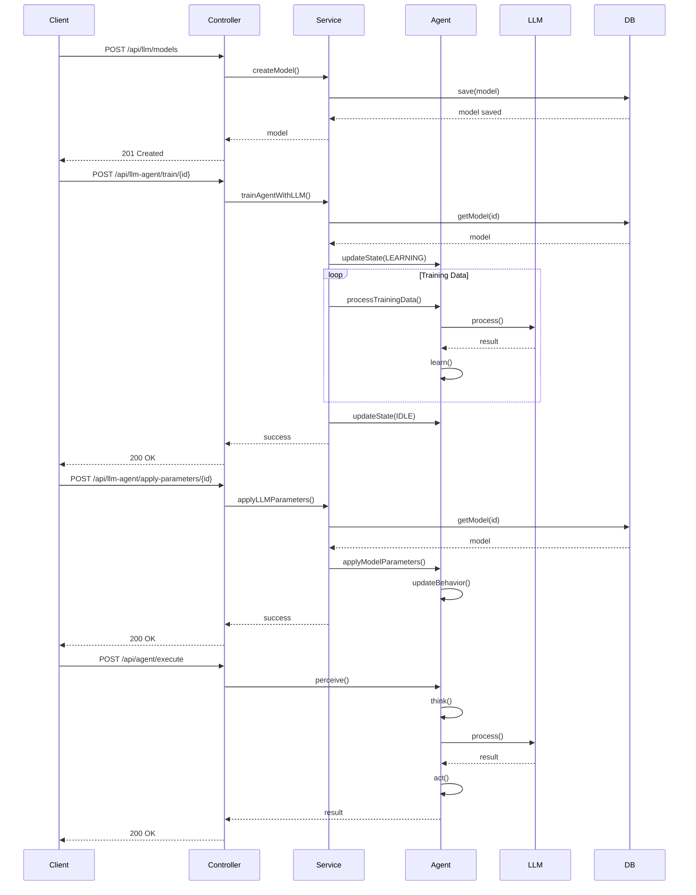

# Diagrama de Secuencia del Sistema LLM-Agente

## Explicación del Flujo

1. **Creación de Modelo**
   - El cliente envía una solicitud para crear un nuevo modelo
   - El controlador delega al servicio
   - El servicio persiste el modelo en la base de datos

2. **Entrenamiento**
   - El cliente inicia el entrenamiento
   - El agente entra en estado de aprendizaje
   - Se procesan los datos de entrenamiento
   - El LLM procesa y devuelve resultados
   - El agente aprende de los resultados

3. **Aplicación de Parámetros**
   - El cliente solicita aplicar parámetros
   - Se obtiene el modelo de la base de datos
   - Se actualizan los parámetros del agente
   - Se actualiza el comportamiento

4. **Ejecución**
   - El cliente solicita una ejecución
   - El agente percibe el entorno
   - Procesa la información con el LLM
   - Ejecuta la acción correspondiente
   - Devuelve el resultado 